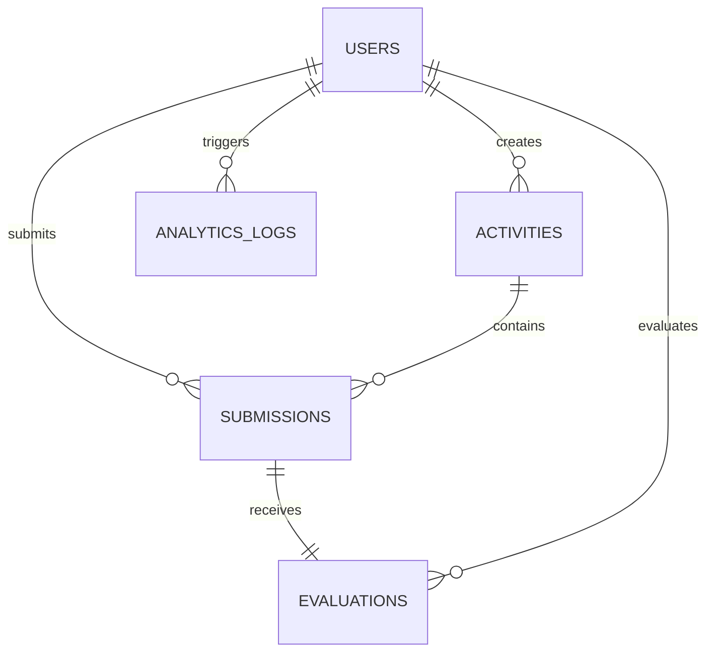

# Database Design Documentation

This document describes the schema structure, design strategies, and relationships of the database layer for the **CIE2-Activity-Management-System**.

## Relational Schema Diagram (Logical Structure)

## Tables & Description

### 1. `users`
*   **Purpose**: Stores student, teacher, and admin login accounts.
*   **Integrity Rules**: 
    *   `email` and `username` must be unique.
    *   `role` restricted to 'student', 'teacher', 'admin'.

### 2. `activities`
*   **Purpose**: Stores learning exercises assigned by instructors.
*   **Integrity Rules**: 
    *   `max_marks` must be greater than zero.
    *   `activity_type` check constraints: 'lab', 'quiz', 'exam'.

### 3. `submissions`
*   **Purpose**: Stores student deliverables matching specific activities.
*   **Integrity Rules**: 
    *   Cascades deletions when activity is removed.

### 4. `quizzes` & `quiz_questions`
*   **Purpose**: Manages MCQ quiz models and options.
*   **Data Types**: `options` are stored as structural JSON.

### 5. `evaluations`
*   **Purpose**: Tracks scores and qualitative comments.
*   **Integrity Rules**: 
    *   1:1 mapping with submissions (`submission_id` is UNIQUE).

### 6. `analytics_logs`
*   **Purpose**: System logs for monitoring traffic load and activities.

## Performance Optimization (Indexes)
- B-Tree index created on foreign keys (`student_id`, `activity_id`) to accelerate dashboard loads.
- Unique constraints implicitly index candidate keys.
