# CIE-2 Activity Tracking, Evaluation & Performance Management System
## Production-Ready Database Architecture Design Documentation
**Author:** Senior Database Architect  
**DBMS:** MySQL 8.0+ (InnoDB Engine)  
**Target Compliance:** 3rd Normal Form (3NF+) & University Enterprise ERP standards

---

## 1. Architectural Overview & Relational Schema Diagram (ERD)

This database architecture is designed for scale, flexibility, and absolute consistency. By combining traditional highly-normalized relational tables for academic transactions with an **Entity-Attribute-Value (EAV)** design for activities, we allow developers to introduce entirely new learning modules, rubric structures, and custom student workflows without modifying the physical schema or triggering table locks.

### Mermaid Entity Relationship Diagram

```mermaid
erDiagram
    ACADEMIC_YEARS ||--o{ SEMESTERS : "contains"
    DEPARTMENTS ||--o{ SUBJECTS : "manages"
    DEPARTMENTS ||--o{ STUDENT_PROFILES : "enrolls"
    DEPARTMENTS ||--o{ TEACHER_PROFILES : "employs"
    
    USERS ||--|| STUDENT_PROFILES : "owns 1:1"
    USERS ||--|| TEACHER_PROFILES : "owns 1:1"
    
    SEMESTERS ||--o{ SUBJECT_ALLOCATIONS : "allocates within"
    SUBJECTS ||--o{ SUBJECT_ALLOCATIONS : "linked from"
    TEACHER_PROFILES ||--o{ SUBJECT_ALLOCATIONS : "assigned to"
    
    STUDENT_PROFILES ||--o{ STUDENT_COURSE_ENROLLMENTS : "registers for"
    SUBJECT_ALLOCATIONS ||--o{ STUDENT_COURSE_ENROLLMENTS : "hosts"
    
    SUBJECT_ALLOCATIONS ||--o{ ACTIVITIES : "holds"
    ACTIVITY_TYPES ||--o{ ACTIVITIES : "classifies"
    
    ACTIVITY_TYPES ||--o{ FIELD_DEFINITIONS : "exposes dynamic fields"
    ACTIVITY_TEMPLATES ||--o{ FIELD_DEFINITIONS : "gathers details"
    
    ACTIVITIES ||--o{ ACTIVITY_FIELD_VALUES : "has specs"
    FIELD_DEFINITIONS ||--o{ ACTIVITY_FIELD_VALUES : "defines data-type of"
    
    ACTIVITIES ||--o{ EVALUATION_RUBRICS : "defines gradings"
    
    ACTIVITIES ||--o{ ACTIVITY_QUIZZES : "comprises MCQs"
    QUIZ_QUESTIONS ||--o{ ACTIVITY_QUIZZES : "linked through"
    QUIZ_BANKS ||--o{ QUIZ_QUESTIONS : "groups"
    QUIZ_QUESTIONS ||--o{ QUIZ_QUESTION_OPTIONS : "has selections"
    
    STUDENT_PROFILES ||--o{ SUBMISSIONS : "executes"
    ACTIVITIES ||--o{ SUBMISSIONS : "collects"
    
    SUBMISSIONS ||--o{ SUBMISSION_FILES : "contains uploads"
    SUBMISSIONS ||--|| STUDENT_QUIZ_ATTEMPTS : "tracks MCQs 1:1"
    STUDENT_QUIZ_ATTEMPTS ||--o{ STUDENT_QUIZ_ANSWERS : "logs clicks"
    QUIZ_QUESTIONS ||--o{ STUDENT_QUIZ_ANSWERS : "queries"
    QUIZ_QUESTION_OPTIONS ||--o{ STUDENT_QUIZ_ANSWERS : "selects"
    
    SUBMISSIONS ||--|| EVALUATIONS : "receives grades 1:1"
    EVALUATIONS ||--o{ EVALUATION_RUBRIC_SCORES : "distributes score"
    EVALUATION_RUBRICS ||--o{ EVALUATION_RUBRIC_SCORES : "scores details"
    
    SUBMISSIONS ||--o{ EVALUATION_REVIEWS : "peer/AI reviewed"
    
    SUBJECT_ALLOCATIONS ||--o{ ATTENDANCE_SESSIONS : "holds lecture"
    ATTENDANCE_SESSIONS ||--o{ STUDENT_ATTENDANCE : "tracks student presence"
    STUDENT_PROFILES ||--o{ STUDENT_ATTENDANCE : "assigned to"
    
    STUDENT_PROFILES ||--o{ CERTIFICATES : "receives"
    ACADEMIC_YEARS ||--o{ CERTIFICATES : "valid for"
    
    STUDENT_PROFILES ||--o{ AI_ANALYTICS_INSIGHTS : "forecasts behavior"
    STUDENT_PROFILES ||--o{ STUDENT_SUBJECT_SUMMARIES : "caches overall grade"
    SUBJECT_ALLOCATIONS ||--o{ STUDENT_SUBJECT_SUMMARIES : "averages overall grade"
    
    USERS ||--o{ USER_DEVICES : "registers"
    USERS ||--o{ NOTIFICATIONS : "reads notifications"
    USERS ||--o{ AUDIT_LOGS : "logs actions"
```

---

## 2. The Dynamic Metadata System (EAV Mode)

Storing diverse activity types (e.g. programming labs, online MCQs, audio-visual reviews, or team projects) in traditional columns leads to highly-sparse tables with many `NULL` values and calls for constant schema alterations. 

To solve this, our design utilizes an **Entity-Attribute-Value (EAV)** paradigm:
1. **`activity_types`**: Acts as the semantic definition for an activity class (e.g. `code` = `LAB`, `QUIZ`, `PROJECT`).
2. **`field_definitions`**: Declares what custom attributes must exist for that activity class, detailing the type (`STRING`, `NUMBER`, `BOOLEAN`, `FILE`, `JSON`), whether it is mandatory, and optional validation regex rules in JSON format.
3. **`activities`**: Stores the shared relational attributes common across all evaluation tasks (e.g. `subject_allocation_id`, `title`, `max_marks`, `deadline`).
4. **`activity_field_values`**: Holds the row-specific parameter mappings. For instance, a Lab Activity will map to `programming_language` = `C++` or `github_repo_required` = `true`. A Quiz Activity will map to `time_limit_mins` = `45` and `shuffle_questions` = `true`.

### Extensibility Verification
To add a new activity type like **"AI-Assisted Case Study"** or **"Video Presentation"**:
- **Step 1:** Insert a new row in `activity_types`.
- **Step 2:** Define needed parameters (e.g. `max_video_length_seconds`, `allowed_mime_types`) as rows in `field_definitions`.
- **Step 3:** Teachers can immediately create activities of this type. The application will render forms dynamically based on `field_definitions` and store values in `activity_field_values` without running `ALTER TABLE`.

---

## 3. Data Integrity & Normalization Rules

*   **1st Normal Form (1NF)**: Every table cell contains only atomic values. Repeating groups (like MCQ options or rubric specs) are split out into their own relations (`quiz_question_options`, `evaluation_rubrics`).
*   **2nd Normal Form (2NF)**: All non-prime attributes are fully functionally dependent on the primary keys. We separate multi-role entity details (e.g. `student_profiles` and `teacher_profiles` contain specific academic metrics, while authentication resides exclusively in `users`).
*   **3rd Normal Form (3NF)**: Transitively dependent fields are eliminated. For example, a student is enrolled in a specific class section via `student_course_enrollments` referencing `subject_allocations` rather than keeping copy columns mapping teacher and course directly in the student registration row.

---

## 4. Performance & Indexing Strategy

To keep dashboards loading instantly and guarantee that grading/submitting transactions do not block under heavy concurrent teacher and student use, we enforce the following indexing logic:

*   **Composite Covering Indexes**:
    *   `student_profiles (current_semester_id, department_id)`: Accelerates sorting and filtration when generating class records.
    *   `subject_allocations (semester_id, teacher_id)`: Speeds up teacher homepages loading their active courseload.
    *   `submissions (activity_id, submission_status)`: Quickly lists ungraded submissions to instructors.
*   **Unique Index Integrity Safeguards**:
    *   `UNIQUE (activity_id, student_id, deleted_at)`: Prevents multiple active submissions from the same student for a single activity. Incorporates the soft-delete timestamp to ensure that if a student had their submission deleted, they can re-upload without constraint conflicts.
*   **Transaction Performance**:
    *   Every foreign key has an index declared explicitly to optimize search path traversals during joins, preventing full-table scans.

---

## 5. Security & Maintenance Operations

### A. Soft-Delete Strategy
To satisfy strict academic compliance, records are never immediately expunged from the hard disk. Instead:
- We track deletions via `is_deleted` (Boolean) and `deleted_at` (Timestamp).
- To bypass unique index conflicts in MySQL (for example, re-creating a user profile with an email that is present elsewhere in a soft-deleted row), we default `deleted_at` to `'1970-01-01 00:00:00'` rather than `NULL` for active records.
- Soft-deleted items update their `deleted_at` to `CURRENT_TIMESTAMP`, which frees up the unique composite index (e.g. `UNIQUE(email, deleted_at)`) for new registrations while preserving historical logs.

### B. Audit Trail & Compliance
Any write event (inserts, updates, soft deletes) is pushed to the `audit_logs` table:
- Captures the operator's ID, the action, tables affected, and client parameters (IP address, user agent).
- Stashes snapshot information of the columns edited inside structured `old_values` and `new_values` JSON structures, allowing easy rolling audits.

### C. Version History Strategy
For critical components like student uploads and activity specifications:
- `activity_versions` preserves full specifications each time a teacher edits titles/deadlines post-publication.
- `submission_versions` and `submission_file_versions` logs sequential uploads, allowing students to resubmit files without overwriting previous attempts in case of disputes.

---

## 6. Backup, Partitioning & High Availability

For production deployment at a university handling 10,000+ active students:
1.  **Backup Plan**:
    *   **Daily Incremental Backups**: Log binary transactions (`mysqlbinlog`) every 15 minutes to guarantee Point-in-Time Recovery (PITR) with near-zero data loss.
    *   **Weekly Full Logical Backups**: Scheduled via `mysqldump` during low usage hours (2:00 AM Sundays), compressed, and replicated to isolated, encrypted S3 object stores.
2.  **Read/Write Split (High Availability)**:
    *   Implement a primary-replica cluster architecture. Write events hit the Primary node, which propagates updates asynchronously to read replicas. All student-facing grade lookups and dashboard loads target the read replicas, shielding the primary database server.
3.  **Horizontal Table Partitioning**:
    *   Partition tables like `audit_logs` and `student_quiz_answers` by range on their `created_at` timestamp. Historical records older than 1 academic year can be archived or placed in separate partitions to prevent table read-degradation.
