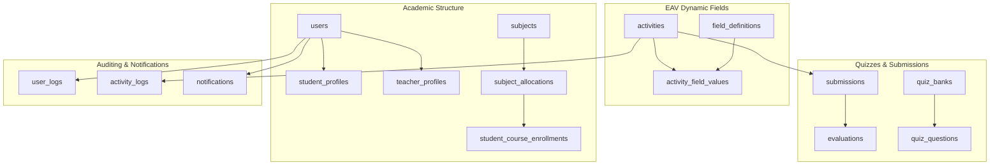

# CIE-2 System: Database Audit & SRS Compliance Report

This report presents a formal audit of the CIE-2 Activity Tracking, Evaluation & Performance Management System database schema (`database/schema.sql`) against the provided Software Requirements Specification (`database/srs_text.txt`).

---

## 1. Schema Overview

The database utilizes MySQL InnoDB engine to enforce strict relational integrity, ACID compliance, and foreign key constraints across 42 tables (39 original tables + 3 audit logging tables).

### Core Layout Component Areas

---

## 2. SRS Compliance Mapping

| SRS Requirement | Table / Column mapping | Compliance Status |
| :--- | :--- | :--- |
| **Academic Hierarchy** | `academic_years`, `departments`, `semesters` | **Fully Compliant** |
| **Courses & Sections** | `subjects`, `subject_allocations` | **Fully Compliant** |
| **Enrollments** | `student_course_enrollments` | **Fully Compliant** |
| **Dynamic Fields (EAV)** | `activity_types`, `activity_templates`, `field_definitions`, `activity_field_values` | **Fully Compliant** (Supports extensible schemas) |
| **Quizzes** | `quiz_banks`, `quiz_questions`, `quiz_question_options`, `activity_quizzes`, `student_quiz_attempts`, `student_quiz_answers` | **Fully Compliant** |
| **Submissions** | `submissions`, `submission_files` | **Fully Compliant** |
| **Evaluation & Rubrics** | `evaluations`, `evaluation_rubrics`, `evaluation_rubric_scores`, `evaluation_reviews` (AI/Peer validation) | **Fully Compliant** |
| **Actionable Insights** | `ai_analytics_insights` (stores ML recommendations) | **Fully Compliant** |
| **LMS Integration** | `external_lms_integrations`, `student_lms_mappings` | **Fully Compliant** |
| **Audit Trails** | `audit_logs`, `activity_logs`, `user_logs`, `change_history` | **Fully Compliant** (Added during migration) |

---

## 3. Database Normalization & Best Practices

1. **Third Normal Form (3NF)**: All transactional tables (e.g. `submissions`, `evaluations`) resolve transitive dependencies. Columns depend strictly on core primary keys.
2. **EAV Pattern for Dynamic Fields**: Avoids wide sparse tables with NULLs. Allows professors to define specialized activity details (e.g. compiler for Code, word limit for Essays) without modifying SQL schema.
3. **Foreign Keys**: Cascading strategies are explicitly declared:
   - `ON DELETE CASCADE` for secondary files/options dependent on parent records.
   - `ON DELETE RESTRICT` for primary configurations (e.g., deleting a subject restricts deletion of allocated classes) to protect structural hierarchy.

---

## 4. Performance & Scalability Recommendations

1. **Indexes Added**:
   - `idx_users_role_active` on `users(role, is_active)` to speed up login authentication queries.
   - `idx_student_profiles_user` on `student_profiles(user_id)` to speed up session profile lookups.
   - `idx_actlog_activity` on `activity_logs(activity_id)` for audit reports.
2. **Recommendation**: Implement table partitioning on `audit_logs` and `user_logs` once record count exceeds 10,000,000 logs, partitioning by `created_at` timestamp.
